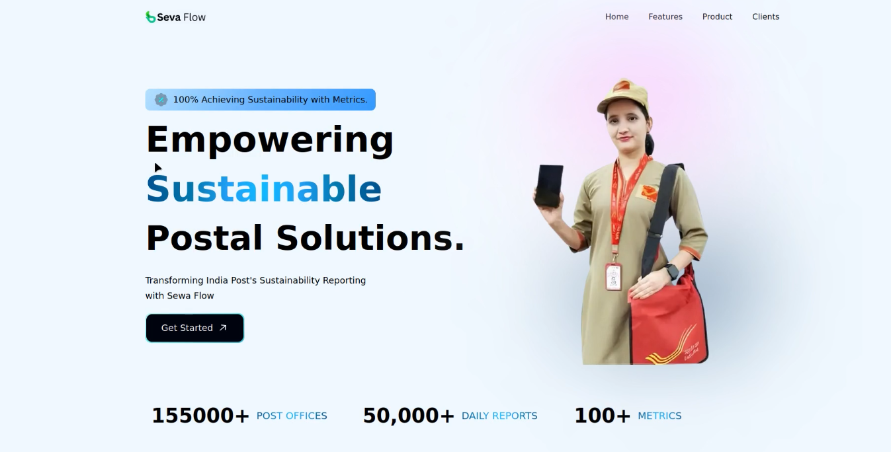
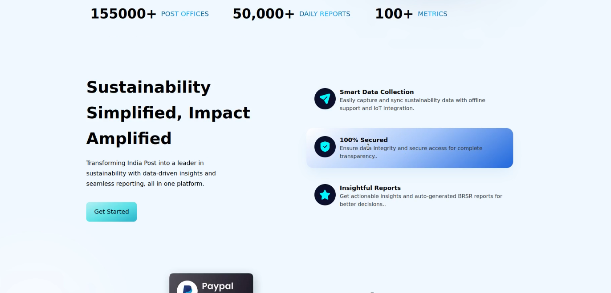
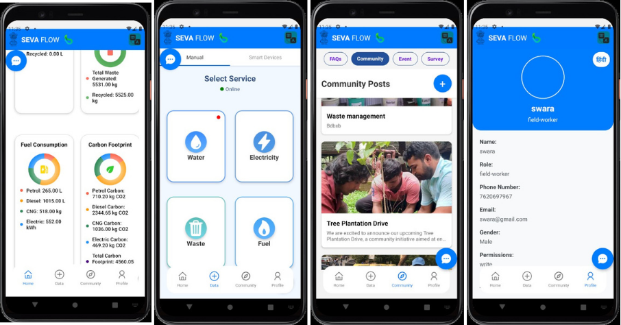

# SIH-1754: Web and App-Based Platform for Department of Post

## Overview

The **SIH-1754** project is a comprehensive web and mobile platform developed for the **Department of Post**, Ministry of Communications. The platform is designed to facilitate a range of services including data collection, analytics, role-based access management, and user interaction. It supports both **web** and **mobile** applications for users in various roles like Admin, Field Workers, District Heads, etc.

- **Web Platform**: Developed using **Next.js** for dynamic content, SEO-friendly capabilities, and efficient state management.
- **Mobile App**: Built using **React Native**, enabling cross-platform development for both Android and iOS with support for offline data entry, AI features, and IoT integration.

## Features

### Web Platform
The web platform provides various administrative tools and data visualizations. Key features include:

- **Analytics**: Provides insightful data visualizations for monitoring various data sources.
- **BRSR (Business Responsibility and Sustainability Reporting)**: Track and report sustainable business practices.
- **State Management**: Centralized state management for handling user interactions, data flow, and component updates.
- **Admin Dashboard**: Comprehensive dashboard for managing users, viewing reports, and controlling platform settings.
- **Role-Based Access Control (RBAC)**: Different levels of access based on user roles (Admin, District Head, Field Master, etc.).
- **Survey Management**: Tools to manage and analyze data from surveys submitted by field workers and other users.
- **Authentication**: Secure login and registration, supporting multiple methods (Email, Phone Number, etc.).
- **Sustainability Reports**: Generate reports on environmental impact, energy consumption, and more.

### Website Images



### Mobile App
The mobile app focuses on providing seamless data collection, interaction, and offline functionality. Key features include:

- **Analytics**: On-the-go data analytics to visualize collected data in real time.
- **AI Integration**: Artificial intelligence to optimize data collection, detect anomalies, and generate insights.
- **Community**: Chat system for users to interact with each other, participate in events, and communicate with admin.
- **Survey**: Field workers can submit survey data through customizable forms.
- **Data Entry**: Forms to enter various data types such as electricity, water, fuel, and waste.
- **Offline Data Entry**: Ability to collect data even when the device is offline, syncing with the server when a connection is restored.
- **IoT-Based Data Entry**: Integration with IoT devices for automatic data collection (e.g., smart meters, sensors).
- **Language Support**: Multi-language support to cater to diverse regions and users.

  ### App Images


## Project Structure

### App Structure (React Native)

```
app

SIH1754
├── admin
│   ├── components
│   │   └── Sidebar.jsx
│   └── page.jsx
├── api
│   └── signup
│       └── route.js
├── auth
│   ├── components
│   │   ├── Login.jsx
│   │   └── Signup.jsx
│   ├── signup
│   │   ├── page.jsx
│   │   └── Signup.jsx
│   └── page.jsx
├── districthead
│   ├── components
│   │   └── Sidebar.jsx
│   └── page.jsx
├── fieldmaster
│   ├── components
│   │   ├── Analytics.jsx
│   │   ├── Entry.jsx
│   │   ├── FieldWorkers.jsx
│   │   ├── Sidebar.jsx
│   │   └── Survey.jsx
│   └── page.jsx
├── unauthorized
│   └── page.jsx
└── page.tsx
```

### Web Platform Structure (Next.js)

```
web

web-SIH1754
├── app
│   ├── admin
│   │   ├── components
│   │   │   └── Sidebar.jsx
│   │   └── page.jsx
│   ├── api
│   │   └── signup
│   │       └── route.js
│   ├── auth
│   │   ├── components
│   │   │   ├── Login.jsx
│   │   │   └── Signup.jsx
│   │   ├── signup
│   │   │   ├── page.jsx
│   │   │   └── Signup.jsx
│   │   └── page.jsx
│   ├── districthead
│   │   ├── components
│   │   │   └── Sidebar.jsx
│   │   └── page.jsx
│   ├── fieldmaster
│   │   ├── components
│   │   │   ├── Analytics.jsx
│   │   │   ├── Entry.jsx
│   │   │   ├── FieldWorkers.jsx
│   │   │   ├── Sidebar.jsx
│   │   │   └── Survey.jsx
│   │   └── page.jsx
│   ├── unauthorized
│   │   └── page.jsx
│   └── page.tsx
├── components
│   ├── ui
│   │   ├── button.tsx
│   │   ├── card.tsx
│   │   ├── chart.tsx
│   │   ├── input.tsx
│   │   ├── label.tsx
│   │   ├── select.tsx
│   │   ├── table.tsx
│   │   └── select.tsx
│   ├── Billing.tsx
│   ├── Business.tsx
│   ├── Button.tsx
│   ├── CardDeal.tsx
│   ├── CTA.tsx
│   ├── Footer.tsx
│   ├── GetStarted.tsx
│   ├── Hero.tsx
│   ├── Navbar.tsx
│   ├── Stats.tsx
├── constants
│   └── index.ts
├── lib
│   └── utils.ts
├── public
│   ├── assets
├── styles
│   ├── globals.css
│   └── style.ts
└── types
│   └── index.ts
│
│   .gitignore
│   FirebaseConfig.js
│   next.config.js
│   package-lock.json
│   package.json
│   postcss.config.js
│   tailwind.config.js
│   tsconfig.json
│   README.md
```


## Setup Instructions

### Web Platform

1. Clone the repository:

Navigate to the project directory:
  ```bash
cd web-SIH1754
```

install the dependencies
```bash
npm install
```

Start the development server
```bash
npm run dev
```

### Mobile App

Navigate to the project directory:
```bash
cd SIH1754
```

install the dependencies 
```bash
npm install
```

Start the development server
```bash
npm expo start
```

## Key Technologies

- **Web**: 
  - Next.js
  - React
  - Tailwind CSS
  - Firebase
  - TypeScript
  
- **Mobile App**: 
  - React Native
  - Expo
  - Firebase
  - TypeScript

- **State Management**: 
  - React Context API
  - async storage

- **Authentication**: 
  - Firebase Authentication

- **Analytics**: 
  - Firebase Analytics
  - Custom Data Visualizations


## Authors

- [Prathamesh Jakkula](https://github.com/Prathamesh01110)
- [Swara Patil](https://github.com/swara-patil-01)
- [Satyaprakash Gupta](https://github.com/Satya481)
- [Adarsh Singh](https://github.com/ctype)
- [Prem Kakade](https://github.com/premexe)
- [Mohit Kattungal](https://github.com/mohitxgithub)


